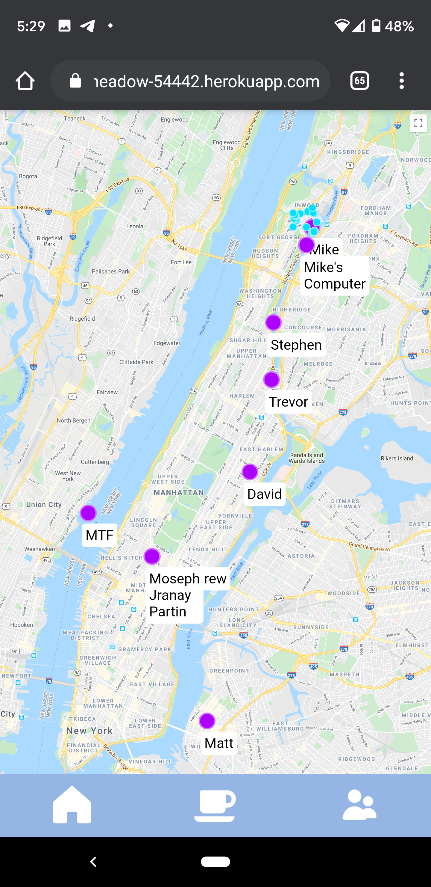
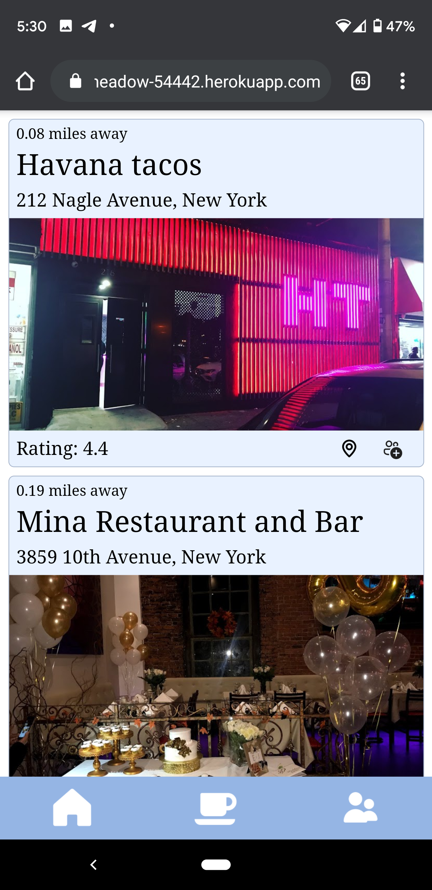
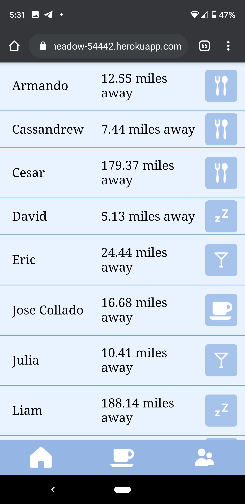

# Find My Friends
[Live Mobile Version](https://stormy-meadow-54442.herokuapp.com/)

A mobile first app that allows users to share their real-time geographic positions and get nearby place recommendations based on a user's selected mood.

User latitude and longitude coordinates are pulled in real-time using the [HTML Geolocation API](https://developer.mozilla.org/en-US/docs/Web/API/Geolocation_API). These coordinates are then overlaid as a pointer on an interactive map component that pulls data from the [Google Maps API](https://developers.google.com/maps/documentation/javascript/overview). Requests are sent to the [Google Places API](https://developers.google.com/places/web-service/overview) every time 1000ft distance is traveled by the user from their previous location. This minimizes the amount of requests needed, while still displaying place information most relevant to the user's current location.

|   |   |
|---|---|

 

## Table of Contents
1. [Tech Stack](##Tech-Stack)
2. [API Used](#API-Used)
3. [Components](##Components)

---

## Tech-Stack
- [React](https://reactjs.org/)
- [Node.js](nodejs.org)
- [mongoDB](https://www.mongodb.com/)
- [Express](http://expressjs.com/)
- [Sass](https://sass-lang.com/)

---

## API-Used
- [HTML Geolocation API](https://developer.mozilla.org/en-US/docs/Web/API/Geolocation_API)
- [Google Maps JavaScript API](https://developers.google.com/maps/documentation/javascript/overview)
- [Google Places API](https://developers.google.com/places/web-service/overview)

---

## Components

|   |   |  |
|---|---|---|

### Map
>Interactive map component that displays all active users' live locations and nearby place markers.

### Nearby Place Recommendations
>Displays 20 nearby recommended places based on the user's selected mood, with the ability to click and view the place on the map.

### Friends Listing
>Displays the distance between the user and other active users along with their current moods.
